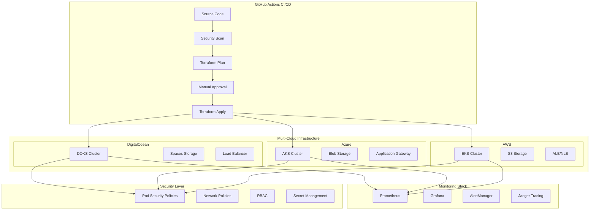

# 🚀 Terraform Multi-Cloud Kubernetes Platform

[](https://www.terraform.io/)
[](https://opensource.org/licenses/MIT)
[](https://github.com/animesh-mukherjee-devops/terraform-multicloud-kubernetes/actions)
[](https://github.com/animesh-mukherjee-devops/terraform-multicloud-kubernetes/security)

> **A production-ready, cloud-agnostic Kubernetes infrastructure automation platform built with Terraform, supporting DigitalOcean, Azure, and AWS with enterprise-grade security and monitoring.**

## 📋 Table of Contents

- [✨ Features](#-features)
- [🏗️ Architecture](#️-architecture)
- [🚀 Quick Start](#-quick-start)
- [📁 Project Structure](#-project-structure)
- [☁️ Supported Cloud Providers](#️-supported-cloud-providers)
- [🔧 Configuration](#-configuration)
- [🔐 Security Features](#-security-features)
- [📊 Monitoring & Observability](#-monitoring--observability)
- [🔄 CI/CD Integration](#-cicd-integration)
- [📖 Usage Examples](#-usage-examples)
- [🔍 Troubleshooting](#-troubleshooting)
- [🤝 Contributing](#-contributing)
- [📄 License](#-license)

## ✨ Features

### 🌐 Multi-Cloud Support
- **DigitalOcean Kubernetes (DOKS)** - Cost-effective, developer-friendly
- **Azure Kubernetes Service (AKS)** - Enterprise-grade with Azure integration
- **Amazon Elastic Kubernetes Service (EKS)** - AWS-native with extensive service integration

### 🔒 Enterprise Security
- **Pod Security Standards** enforcement
- **Network Policies** for micro-segmentation
- **RBAC** with least-privilege access
- **Secret management** with cloud-native solutions
- **Security scanning** with Checkov and tfsec
- **Compliance-ready** configurations

### 📊 Built-in Observability
- **Prometheus** for metrics collection
- **Grafana** for visualization and alerting
- **Centralized logging** with Fluentd/Fluent Bit
- **Service mesh** support (Istio/Linkerd)
- **Cost monitoring** and optimization

### 🚀 Production Features
- **Auto-scaling** node pools with intelligent scaling policies
- **Multi-environment** support (dev, staging, production)
- **Blue-green deployments** capability
- **Disaster recovery** with cross-cloud backup strategies
- **High availability** with multi-AZ deployments
- **Zero-downtime upgrades** with surge upgrade support

### 🔧 Developer Experience
- **GitOps-ready** with ArgoCD integration
- **Helm chart** deployments
- **Local development** environment setup
- **Comprehensive documentation** and examples
- **IDE integration** with Terraform extensions

## 🏗️ Architecture



## 🚀 Quick Start

### Prerequisites

Ensure you have the following tools installed:

```bash
# Required tools
terraform >= 1.6.0
kubectl >= 1.28.0
helm >= 3.12.0

# Optional but recommended
docker >= 24.0.0
git >= 2.40.0
```

### 1️⃣ Clone and Setup

```bash
# Clone the repository
git clone https://github.com/animesh-mukherjee-devops/terraform-multicloud-kubernetes.git
cd terraform-multicloud-kubernetes

# Copy example configurations
cp terraform/environments/dev/digitalocean/terraform.tfvars.example \
   terraform/environments/dev/digitalocean/terraform.tfvars

# Edit your configuration
nano terraform/environments/dev/digitalocean/terraform.tfvars
```

### 2️⃣ Configure Cloud Credentials

<details>
<summary><b>🟦 DigitalOcean Setup</b></summary>

```bash
# Set environment variables
export DIGITALOCEAN_TOKEN="your-do-api-token"
export SPACES_ACCESS_KEY_ID="your-spaces-access-key"
export SPACES_SECRET_ACCESS_KEY="your-spaces-secret-key"

# Or create .env file (not committed to git)
cat > .env << EOF
DIGITALOCEAN_TOKEN=your-do-api-token
SPACES_ACCESS_KEY_ID=your-spaces-access-key
SPACES_SECRET_ACCESS_KEY=your-spaces-secret-key
EOF
```

</details>

<details>
<summary><b>🔷 Azure Setup</b></summary>

```bash
# Login to Azure
az login

# Set service principal credentials
export ARM_CLIENT_ID="your-client-id"
export ARM_CLIENT_SECRET="your-client-secret"
export ARM_SUBSCRIPTION_ID="your-subscription-id"
export ARM_TENANT_ID="your-tenant-id"

# Alternative: Use Azure CLI authentication (recommended for local development)
az account set --subscription "your-subscription-id"
```

</details>

<details>
<summary><b>🟧 AWS Setup</b></summary>

```bash
# Configure AWS credentials
aws configure

# Or use environment variables
export AWS_ACCESS_KEY_ID="your-access-key"
export AWS_SECRET_ACCESS_KEY="your-secret-key"
export AWS_DEFAULT_REGION="us-east-1"

# For OIDC (recommended for CI/CD)
export AWS_ROLE_ARN="arn:aws:iam::123456789012:role/TerraformRole"
```

</details>

### 3️⃣ Deploy Your First Cluster

```bash
# Navigate to your chosen environment and cloud
cd terraform/environments/dev/digitalocean

# Initialize Terraform
terraform init

# Review the deployment plan
terraform plan -var-file="terraform.tfvars"

# Deploy the infrastructure
terraform apply -var-file="terraform.tfvars"

# Get kubeconfig
terraform output -raw kubeconfig > ~/.kube/config-do-dev
export KUBECONFIG=~/.kube/config-do-dev

# Verify cluster access
kubectl get nodes
kubectl get pods --all-namespaces
```

### 4️⃣ Access Monitoring Dashboard

```bash
# Port forward to Grafana
kubectl port-forward -n monitoring svc/grafana 3000:3000

# Open browser to http://localhost:3000
# Default credentials: admin/admin (change immediately)
```

## 📁 Project Structure

```
terraform-multicloud-kubernetes/
├── 📄 README.md                              # This file
├── 📄 LICENSE                                # MIT License
├── 📄 SECURITY.md                            # Security policies and reporting
├── 📄 CONTRIBUTING.md                        # Contribution guidelines
├── 🔒 .gitignore                            # Git ignore patterns
├── 📄 .terraform-version                     # Terraform version specification
│
├── 📁 terraform/                             # All Terraform configurations
│   ├── 📁 modules/                          # Reusable Terraform modules
│   │   ├── 📁 bootstrap/                    # Backend storage setup
│   │   │   ├── 📁 digitalocean/             # DO Spaces for state
│   │   │   ├── 📁 azure/                    # Azure Blob for state
│   │   │   └── 📁 aws/                      # S3 for state
│   │   ├── 📁 kubernetes/                   # K8s cluster modules
│   │   │   ├── 📁 digitalocean/             # DOKS implementation
│   │   │   ├── 📁 azure/                    # AKS implementation
│   │   │   └── 📁 aws/                      # EKS implementation
│   │   └── 📁 common/                       # Shared modules
│   │       ├── 📁 monitoring/               # Prometheus, Grafana stack
│   │       ├── 📁 security/                 # Security policies
│   │       └── 📁 networking/               # Network configurations
│   │
│   ├── 📁 environments/                     # Environment-specific configs
│   │   ├── 📁 dev/                         # Development environment
│   │   ├── 📁 staging/                     # Staging environment
│   │   └── 📁 production/                  # Production environment
│   │
│   └── 📁 scripts/                         # Utility scripts
│       ├── 📄 setup-backend.sh            # Backend initialization
│       ├── 📄 validate-cluster.sh         # Cluster validation
│       └── 📄 cleanup.sh                  # Resource cleanup
│
├── 📁 .github/                             # GitHub Actions workflows
│   ├── 📁 workflows/                       # CI/CD pipelines
│   │   ├── 📄 terraform-plan.yml          # Plan validation
│   │   ├── 📄 terraform-apply.yml         # Infrastructure deployment
│   │   ├── 📄 security-scan.yml           # Security scanning
│   │   └── 📄 cluster-validation.yml      # Post-deployment tests
│   └── 📄 PULL_REQUEST_TEMPLATE.md        # PR template
│
├── 📁 monitoring/                          # Monitoring configurations
│   ├── 📁 prometheus/                      # Prometheus configs
│   ├── 📁 grafana/                         # Grafana dashboards
│   └── 📁 alerts/                          # Alert manager rules
│
├── 📁 security/                            # Security policies and configs
│   ├── 📁 policies/                        # Kubernetes policies
│   └── 📁 scanning/                        # Security scanning configs
│
├── 📁 tests/                               # Testing suite
│   ├── 📁 unit/                           # Unit tests
│   ├── 📁 integration/                    # Integration tests
│   └── 📁 e2e/                           # End-to-end tests
│
└── 📁 docs/                               # Additional documentation
    ├── 📄 ARCHITECTURE.md                 # Detailed architecture
    ├── 📄 DEPLOYMENT.md                   # Deployment guide
    ├── 📄 MONITORING.md                   # Monitoring setup
    └── 📄 TROUBLESHOOTING.md             # Troubleshooting guide
```

## ☁️ Supported Cloud Providers

| Provider | Service | Regions | Features |
|----------|---------|---------|----------|
| 🟦 **DigitalOcean** | DOKS | 13 regions globally | Cost-effective, simple setup, SSD storage |
| 🔷 **Azure** | AKS | 60+ regions globally | Enterprise features, AD integration, hybrid cloud |
| 🟧 **AWS** | EKS | 25+ regions globally | Extensive AWS integration, managed node groups, Fargate |

### Feature Comparison

| Feature | DigitalOcean | Azure | AWS |
|---------|-------------|-------|-----|
| **Managed Control Plane** | ✅ | ✅ | ✅ |
| **Auto Scaling** | ✅ | ✅ | ✅ |
| **Spot/Preemptible Instances** | ❌ | ✅ | ✅ |
| **GPU Support** | ❌ | ✅ | ✅ |
| **Service Mesh Integration** | ✅ | ✅ | ✅ |
| **Identity Integration** | Limited | ✅ (Azure AD) | ✅ (IAM/OIDC) |
| **Cost (Relative)** | 💰 | 💰💰 | 💰💰💰 |

## 🔧 Configuration

### Environment Variables

Create a `.env` file (automatically ignored by git):

```bash
# DigitalOcean
DIGITALOCEAN_TOKEN=dop_v1_your_token_here
SPACES_ACCESS_KEY_ID=your_spaces_access_key
SPACES_SECRET_ACCESS_KEY=your_spaces_secret_key

# Azure
ARM_CLIENT_ID=your_client_id
ARM_CLIENT_SECRET=your_client_secret
ARM_SUBSCRIPTION_ID=your_subscription_id
ARM_TENANT_ID=your_tenant_id

# AWS
AWS_ACCESS_KEY_ID=your_access_key
AWS_SECRET_ACCESS_KEY=your_secret_key
AWS_DEFAULT_REGION=us-east-1
```

### Terraform Variables

Key configuration options in `terraform.tfvars`:

```hcl
# Cluster Configuration
cluster_name = "my-k8s-cluster"
environment  = "dev"
region      = "nyc3"  # or your preferred region

# Node Pool Configuration
main_node_pool = {
  size       = "s-2vcpu-4gb"
  node_count = 2
  auto_scale = true
  min_nodes  = 1
  max_nodes  = 5
  labels = {
    role = "general"
  }
}

# Additional node pools for specialized workloads
additional_node_pools = {
  "high-memory" = {
    size       = "m-2vcpu-16gb"
    node_count = 1
    auto_scale = true
    min_nodes  = 0
    max_nodes  = 3
    labels = {
      workload = "memory-intensive"
    }
    taints = [
      {
        key    = "workload"
        value  = "memory-intensive"
        effect = "NoSchedule"
      }
    ]
  }
}

# Feature Flags
install_monitoring        = true
configure_rbac           = true
enable_security_policies = true
create_vpc              = true
```

## 🔐 Security Features

### Pod Security Standards

We implement Pod Security Standards at the cluster level:

```yaml
# Applied automatically by our security module
apiVersion: v1
kind: Namespace
metadata:
  name: production-workloads
  labels:
    pod-security.kubernetes.io/enforce: restricted
    pod-security.kubernetes.io/audit: restricted
    pod-security.kubernetes.io/warn: restricted
```

### Network Policies

Default deny-all network policy with explicit allowlists:

```yaml
# Example network policy (auto-applied)
apiVersion: networking.k8s.io/v1
kind: NetworkPolicy
metadata:
  name: default-deny-ingress
spec:
  podSelector: {}
  policyTypes:
  - Ingress
```

### RBAC Configuration

Least-privilege RBAC with custom roles:

```yaml
# Developer role example
apiVersion: rbac.authorization.k8s.io/v1
kind: Role
metadata:
  name: developer
rules:
- apiGroups: ["", "apps", "extensions"]
  resources: ["pods", "deployments", "services"]
  verbs: ["get", "list", "create", "update", "patch"]
```

### Secret Management

Integration with cloud-native secret management:

- **DigitalOcean**: Kubernetes Secrets with encryption at rest
- **Azure**: Azure Key Vault integration
- **AWS**: AWS Secrets Manager and Parameter Store integration

## 📊 Monitoring & Observability

### Pre-configured Stack

Our monitoring stack includes:

- **🔍 Prometheus**: Metrics collection and alerting
- **📊 Grafana**: Visualization and dashboards
- **🚨 AlertManager**: Alert routing and management
- **📋 Loki**: Log aggregation (optional)
- **🔗 Jaeger**: Distributed tracing (optional)

### Custom Dashboards

We provide production-ready Grafana dashboards for:

- **Cluster Overview**: Node health, resource utilization
- **Application Metrics**: Pod metrics, service performance
- **Cost Monitoring**: Resource costs across clouds
- **Security Dashboard**: Security events and compliance

### Sample Alerts

Pre-configured alerts for common scenarios:

```yaml
# High CPU usage alert
- alert: HighCPUUsage
  expr: node_cpu_usage > 80
  for: 5m
  labels:
    severity: warning
  annotations:
    summary: "High CPU usage detected"
```

## 🔄 CI/CD Integration

### GitHub Actions Workflows

Our CI/CD pipeline includes:

1. **🔍 Security Scanning**: Checkov, tfsec, and custom policies
2. **📋 Plan Review**: Terraform plan with cost estimation
3. **✅ Approval Gates**: Manual approval for production deployments
4. **🚀 Deployment**: Multi-cloud parallel deployment
5. **🧪 Validation**: Post-deployment health checks

### Integration with External CI/CD

Easy integration with other CI/CD platforms:

<details>
<summary><b>Jenkins Integration</b></summary>

```groovy
pipeline {
    agent any
    
    stages {
        stage('Download Kubeconfig') {
            steps {
                script {
                    // Download kubeconfig artifact from GitHub Actions
                    sh '''
                        curl -H "Authorization: token ${GITHUB_TOKEN}" \
                             -H "Accept: application/vnd.github.v3+json" \
                             https://api.github.com/repos/your-org/terraform-multicloud-kubernetes/actions/artifacts \
                             | jq -r '.artifacts[] | select(.name=="kubeconfig-digitalocean") | .archive_download_url' \
                             | xargs curl -H "Authorization: token ${GITHUB_TOKEN}" -L -o kubeconfig.zip
                        unzip kubeconfig.zip
                    '''
                }
            }
        }
        
        stage('Deploy Application') {
            steps {
                sh '''
                    export KUBECONFIG=./kubeconfig
                    helm upgrade --install myapp ./helm-chart
                '''
            }
        }
    }
}
```

</details>

<details>
<summary><b>GitLab CI Integration</b></summary>

```yaml
deploy:
  stage: deploy
  image: alpine/helm:latest
  before_script:
    - apk add --no-cache curl jq
    - curl -H "Authorization: token $GITHUB_TOKEN" \
           -H "Accept: application/vnd.github.v3+json" \
           https://api.github.com/repos/your-org/terraform-multicloud-kubernetes/actions/artifacts \
           | jq -r '.artifacts[] | select(.name=="kubeconfig-digitalocean") | .archive_download_url' \
           | xargs curl -H "Authorization: token $GITHUB_TOKEN" -L -o kubeconfig.zip
    - unzip kubeconfig.zip
    - export KUBECONFIG=./kubeconfig
  script:
    - helm upgrade --install myapp ./helm-chart
```

</details>

## 📖 Usage Examples

### Basic Single-Cloud Deployment

```bash
# Deploy to DigitalOcean development environment
cd terraform/environments/dev/digitalocean
terraform init
terraform apply -var="cluster_name=my-dev-cluster"

# Get kubeconfig and verify
terraform output -raw kubeconfig > ~/.kube/config
kubectl get nodes
```

### Multi-Cloud Production Deployment

```bash
# Deploy to multiple clouds simultaneously
cd terraform/environments/production

# Deploy to DigitalOcean
cd digitalocean
terraform apply -var-file="terraform.tfvars"

# Deploy to Azure
cd ../azure
terraform apply -var-file="terraform.tfvars"

# Deploy to AWS
cd ../aws
terraform apply -var-file="terraform.tfvars"
```

### Advanced Configuration with Custom Node Pools

```hcl
# terraform.tfvars
additional_node_pools = {
  "gpu-nodes" = {
    size       = "gd-2vcpu-8gb-nvidia-v100-1gpu"  # DigitalOcean GPU droplet
    node_count = 2
    auto_scale = true
    min_nodes  = 0
    max_nodes  = 5
    labels = {
      accelerator = "nvidia-v100"
      workload   = "ml"
    }
    taints = [
      {
        key    = "nvidia.com/gpu"
        value  = "v100"
        effect = "NoSchedule"
      }
    ]
  }
  
  "spot-instances" = {
    size       = "s-4vcpu-8gb"
    node_count = 3
    auto_scale = true
    min_nodes  = 1
    max_nodes  = 10
    labels = {
      node-type = "spot"
      cost-optimized = "true"
    }
    taints = [
      {
        key    = "spot-instance"
        value  = "true"
        effect = "NoSchedule"
      }
    ]
  }
}
```

### Monitoring Setup Example

```bash
# Access Grafana dashboard
kubectl port-forward -n monitoring svc/grafana 3000:3000

# Access Prometheus
kubectl port-forward -n monitoring svc/prometheus-server 9090:9090

# Check AlertManager
kubectl port-forward -n monitoring svc/alertmanager 9093:9093
```

### Application Deployment Example

```yaml
# example-app-deployment.yaml
apiVersion: apps/v1
kind: Deployment
metadata:
  name: sample-app
  namespace: default
spec:
  replicas: 3
  selector:
    matchLabels:
      app: sample-app
  template:
    metadata:
      labels:
        app: sample-app
    spec:
      # Use our configured node selector
      nodeSelector:
        role: general
      containers:
      - name: app
        image: nginx:1.21
        ports:
        - containerPort: 80
        resources:
          requests:
            memory: "64Mi"
            cpu: "50m"
          limits:
            memory: "128Mi"
            cpu: "100m"
        securityContext:
          runAsNonRoot: true
          runAsUser: 1000
          allowPrivilegeEscalation: false
          capabilities:
            drop:
            - ALL
```

## 🔍 Troubleshooting

### Common Issues and Solutions

<details>
<summary><b>🔧 Terraform State Issues</b></summary>

```bash
# State lock issues
terraform force-unlock <lock-id>

# State corruption
terraform state pull > backup.tfstate
terraform state push backup.tfstate

# Import existing resources
terraform import digitalocean_kubernetes_cluster.main <cluster-id>
```

</details>

<details>
<summary><b>🔐 Authentication Problems</b></summary>

```bash
# DigitalOcean token issues
doctl auth init --access-token $DIGITALOCEAN_TOKEN
doctl account get

# Azure authentication
az login
az account set --subscription <subscription-id>

# AWS credentials
aws sts get-caller-identity
```

</details>

<details>
<summary><b>☸️ Kubernetes Access Issues</b></summary>

```bash
# Regenerate kubeconfig
terraform output -raw kubeconfig > ~/.kube/config
chmod 600 ~/.kube/config

# Test connectivity
kubectl cluster-info
kubectl get nodes
kubectl get pods --all-namespaces

# Debug node issues
kubectl describe node <node-name>
kubectl get events --sort-by=.metadata.creationTimestamp
```

</details>

<details>
<summary><b>📊 Monitoring Stack Issues</b></summary>

```bash
# Check monitoring namespace
kubectl get pods -n monitoring

# Restart monitoring components
kubectl rollout restart deployment/prometheus-server -n monitoring
kubectl rollout restart deployment/grafana -n monitoring

# Check persistent volumes
kubectl get pv,pvc -n monitoring
```

</details>

### Resource Limits and Quotas

Common resource-related issues:

| Cloud Provider | Common Limits | Solution |
|----------------|---------------|----------|
| DigitalOcean | 25 droplets per region | Request limit increase |
| Azure | Subscription CPU quota | Increase quota in Azure Portal |
| AWS | Service quotas | Use Service Quotas console |

### Performance Optimization

```bash
# Check cluster resource usage
kubectl top nodes
kubectl top pods --all-namespaces

# Optimize node pools
# Review and adjust auto-scaling settings
# Consider different instance types for different workloads

# Monitor costs
# Use cloud provider cost management tools
# Review and optimize resource requests/limits
```

## 🛡️ Security Best Practices

### Implemented Security Controls

- ✅ **Pod Security Standards**: Restricted profile enforced
- ✅ **Network Policies**: Default deny with explicit allow rules
- ✅ **RBAC**: Least-privilege access control
- ✅ **Secret Management**: Encrypted at rest and in transit
- ✅ **Image Security**: Container image scanning (optional)
- ✅ **Admission Controllers**: Policy enforcement
- ✅ **Security Scanning**: Infrastructure and configuration scanning

### Recommended Additional Security Measures

```bash
# Enable audit logging (cloud-specific)
# Implement image scanning in CI/CD
# Set up security monitoring and alerting
# Regular security assessments
# Keep clusters and nodes updated
```

## 🚀 Advanced Features

### GitOps Integration

```bash
# Install ArgoCD
kubectl create namespace argocd
kubectl apply -n argocd -f https://raw.githubusercontent.com/argoproj/argo-cd/stable/manifests/install.yaml

# Access ArgoCD UI
kubectl port-forward svc/argocd-server -n argocd 8080:443
```

### Service Mesh Support

```bash
# Install Istio (example)
curl -L https://istio.io/downloadIstio | sh -
istioctl install --set values.defaultRevision=default
kubectl label namespace default istio-injection=enabled
```

### Cost Optimization

- **Right-sizing**: Automated resource right-sizing based on usage patterns
- **Spot instances**: Support for spot/preemptible instances where available
- **Auto-scaling**: Intelligent auto-scaling with custom metrics
- **Resource quotas**: Namespace-level resource quotas and limits

## 🤝 Contributing

We welcome contributions! Please see our [Contributing Guide](CONTRIBUTING.md) for details.

### Development Setup

```bash
# Clone the repository
git clone https://github.com/animesh-mukherjee-devops/terraform-multicloud-kubernetes.git
cd terraform-multicloud-kubernetes

# Install pre-commit hooks
pre-commit install

# Run tests
make test

# Run security scans
make security-scan
```

### Contribution Guidelines

1. **🔍 Create an issue** for bugs or feature requests
2. **🌿 Create a feature branch** from `develop`
3. **✅ Write tests** for new functionality
4. **📋 Update documentation** as needed
5. **🔄 Submit a pull request** with clear description

## 📄 License

This project is licensed under the MIT License - see the [LICENSE](LICENSE) file for details.

## 🙏 Acknowledgments

- [Terraform](https://www.terraform.io/) for infrastructure as code
- [Kubernetes](https://kubernetes.io/) for container orchestration
- [Prometheus](https://prometheus.io/) and [Grafana](https://grafana.com/) for monitoring
- Cloud providers for managed Kubernetes services
- The open-source community for continuous inspiration

## 📞 Support

- 📖 **Documentation**: Check our [docs](docs/) folder for detailed guides
- 🐛 **Issues**: [GitHub Issues](https://github.com/animesh-mukherjee-devops/terraform-multicloud-kubernetes/issues)
- 💬 **Discussions**: [GitHub Discussions](https://github.com/animesh-mukherjee-devops/terraform-multicloud-kubernetes/discussions)
- 📧 **Email**: [support@your-domain.com](mailto:support@your-domain.com)

---

<div align="center">
  <p>Made with ❤️ by the DevOps Community</p>
  <p>
    <a href="https://github.com/animesh-mukherjee-devops">
      
    </a>
  </p>
</div>